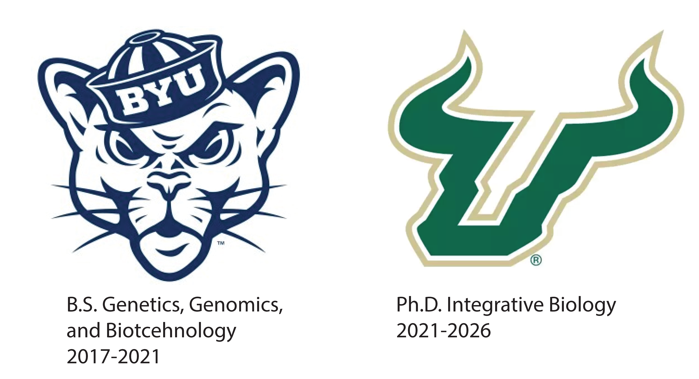

# Samuel R. Hirst

---

**Evolution | Genomics | Ecology | Bioinformatics | Conservation**

**Welcome to my GitHub!**

  
  
  

---

##  Who am I?

<!-- You can upload a PDF image (e.g., a timeline or academic journey) to the repo and link it below -->

  

Hi, I'm **Sam Hirst**, a Postdoctoral Researcher at Columbia University.

I study evolutionary genomics and functional trait evolution. Currently, I am using pangenomes to explore how structural variants shape seasonal migration in songbirds. Previously, for my PhD at the University of South Florida, I used island populations of rattlesnakes to test if ecological theories of species richness can explain the evolution of trait complexity. My work integrates whole-genome sequencing, transcriptomics, ddRADseq, and proteomics to link genotype to phenotype.

I specialize in developing reproducible workflows using shell/Bash scripting, R, and Python, with experience in Unix/Linux environments for high-throughput data processing. I am passionate about open science, mentorship, and bridging basic research with real-world applications.

---

##  Experience

I've been building and applying bioinformatics pipelines since 2018 to investigate key questions in genomics and ecology. Much of my work bridges field biology with computational science, integrating multi-omic datasets in natural populations to study evolutionary processes in non-model organisms.

##  Repositories

My research primarily uses existing tools and pipelines to investigate ecological and evolutionary questions using diverse molecular datasets. These include:

-  Long-read HiFi genome assemblies
-  Short-read genomic data (e.g., ddRADseq, WGS, sequence capture)
-  Transcriptomics
-  Proteomics (e.g., RP-HPLC venom profiles)

Although most of my work centers on analysis using established bioinformatics software, I occasionally develop custom Python scripts to build workflows, reformat datasets, or bridge tools that weren’t originally designed to talk to each other.

###  Repositories by Data Type

| Data Type       | Description                                                                 | Repository |
|-----------------|-----------------------------------------------------------------------------|------------|
| HiFi Genome Assembly & Annotation | HiFi genome assembly and annotation | [`HiFi_Genome_Assembly_and_Annotation`](https://github.com/SamuelRHirst/HiFi_Genome_Assembly_and_Annotation) |
| Transcriptomics | RNA-seq preprocessing, quantification, differential expression              | [`Transcriptomics`](https://github.com/SamuelRHirst/Transcriptomics) |
| Custom Scripts  | Helper functions and file converters written in Python or Bash              | [`Custom_Scripts`](https://github.com/SamuelRHirst/Custom_Scripts) |

Stay tuned as I build these out and share them publicly!

---

