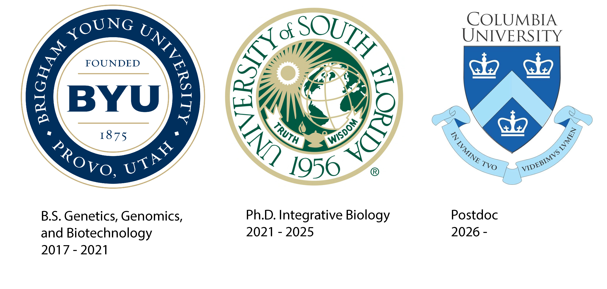

<h1 align="center">Samuel R. Hirst</h1>

<b>Evolution &nbsp;|&nbsp; Genomics &nbsp;|&nbsp; Ecology &nbsp;|&nbsp; Bioinformatics &nbsp;|&nbsp; Conservation</b>

  
  
  
  

---

##  Who am I?

<!-- You can upload a PDF image (e.g., a timeline or academic journey) to the repo and link it below -->

  

Hi, I'm **Sam Hirst**, a Postdoctoral Researcher at Columbia University.

I study evolutionary genomics and functional trait evolution. Currently, I am using pangenomes to explore how structural variants shape seasonal migration in songbirds. Previously, for my PhD at the University of South Florida, I used island populations of rattlesnakes to test if ecological theories of species richness can explain the evolution of trait complexity. My work integrates whole-genome sequencing, transcriptomics, ddRADseq, and proteomics to link genotype to phenotype.

I specialize in developing reproducible workflows using shell/Bash scripting, R, and Python, with experience in Unix/Linux environments for high-throughput data processing. I am passionate about open science, mentorship, and bridging basic research with real-world applications.

---

##  Experience

I've been building and applying bioinformatics pipelines since 2018 to investigate key questions in genomics and ecology. Much of my work bridges field biology with computational science, integrating multi-omic datasets in natural populations to study evolutionary processes in non-model organisms.

##  Repositories

My research primarily uses existing tools and pipelines to investigate ecological and evolutionary questions using diverse molecular datasets. These include:

-  Long-read HiFi genome assemblies
-  Short-read genomic data (e.g., ddRADseq, WGS, sequence capture)
-  Transcriptomics
-  Proteomics (e.g., RP-HPLC venom profiles)

Although most of my work centers on analysis using established bioinformatics software, I occasionally develop custom Python scripts to build workflows, reformat datasets, or bridge tools that weren’t originally designed to talk to each other.

###  Repositories by Data Type

| Data Type       | Description                                                                 | Repository |
|-----------------|-----------------------------------------------------------------------------|------------|
| HiFi Genome Assembly & Annotation | HiFi genome assembly and annotation | [`HiFi_Genome_Assembly_and_Annotation`](https://github.com/SamuelRHirst/HiFi_Genome_Assembly_and_Annotation) |
| Transcriptomics | RNA-seq preprocessing, quantification, differential expression              | [`Transcriptomics`](https://github.com/SamuelRHirst/Transcriptomics) |
| Custom Scripts  | Helper functions and file converters written in Python or Bash              | [`Custom_Scripts`](https://github.com/SamuelRHirst/Custom_Scripts) |

Stay tuned as I build these out and share them publicly!

---

##  Teaching &amp; Open Resources

Mentorship is a core part of how I work, and I try to write the documentation I wish I'd had when I started.

###  [Bioinformatics_Basics](https://github.com/SamuelRHirst/Bioinformatics_Basics)

**A start-from-zero guide to working on a high-performance computing cluster, aimed at biologists who have never opened a terminal.**

Most bioinformatics tutorials assume you already know what a shell is and that your software is installed. This one doesn't. It starts at *"I have an SSH password and a folder of FASTQ files"* and ends with a hard-filtered SNP callset you can defend — written throughout for **non-model, diploid organisms**.

| | |
|---|---|
| **Foundations** | The terminal and SSH, login vs. compute nodes, SLURM job scripts and arrays, project organization, shell scripting |
| **Tooling** | Environment modules, then [pixi](https://pixi.prefix.dev/) for reproducible lockfile-backed environments; using an AI coding agent for cluster work |
| **Pipeline** | 150 bp PE Illumina WGS → fastp → bwa-mem2 → MarkDuplicates → GATK HaplotypeCaller → joint genotyping → hard filtering |
| **Practice** | Runnable SLURM scripts for every stage, ~45 exercises, and a 4 MB practice dataset so you can run the whole pipeline end to end |

Written for the students and collaborators I work with, but hopefully is helpful to anyone that comes across it.

---

